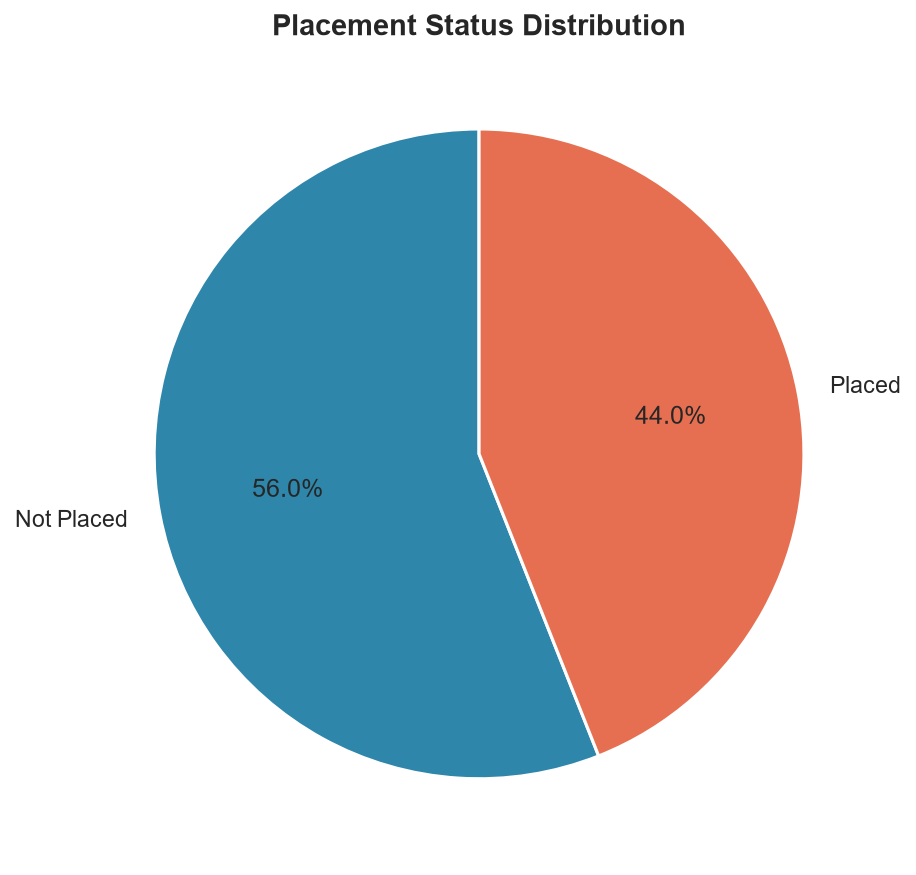

# Student Performance & Placement Analytics Dashboard

<p align="center">
  
  
  
  
</p>

Transforming student data into meaningful academic and placement insights through an end-to-end analytics and dashboard workflow.

## Live Dashboard

The dashboard is running locally at:

http://localhost:8501/

## Overview

This project is a complete Student Performance & Placement Analytics solution that generates a synthetic placement dataset, cleans and validates it, performs exploratory data analysis, and presents the results in a professional Streamlit dashboard.

The project answers questions such as:

- Which academic and skill factors influence placement outcomes?
- How do CGPA, attendance, internships, certifications, and projects affect placement success?
- Which branches and companies produce stronger placement and salary outcomes?

## Features

- 800-record realistic synthetic student placement dataset
- Automated data generation, validation, and cleaning
- 14 visual charts generated from the cleaned data
- Dynamic dashboard filters for Branch, Gender, and Placement Status
- KPI cards, charts, insights, and dataset explorer
- Business-ready report generated in the `reports/` folder
- Automated project tests using `unittest`

## Tech Stack

| Area | Tools |
|---|---|
| Programming Language | Python 3.12+ |
| Data Analysis | Pandas, NumPy |
| Visualization | Matplotlib, Seaborn, Plotly |
| Dashboard | Streamlit |
| Testing | unittest |

## Project Workflow

```text
Raw Dataset
   ↓
Data Cleaning
   ↓
Dataset Validation
   ↓
Exploratory Data Analysis
   ↓
Visualization Generation
   ↓
Streamlit Dashboard
   ↓
Insights Report
```

## Dashboard Screenshot



## Dataset

The generated data file is stored in:

- `data/student_placement_data.csv`
- `data/cleaned_student_data.csv`

It has 800 records and includes fields such as:

- Student_ID
- Student_Name
- Gender
- Age
- Branch
- CGPA
- Attendance_Percentage
- Technical_Skills
- Internships
- Projects
- Certifications
- Aptitude_Score
- Communication_Score
- Placement_Status
- Company
- Salary_Package_LPA

## Repository Structure

```text
Student-Performance-Placement-Analytics/
├── dashboard/
│   └── app.py
├── data/
│   ├── cleaned_student_data.csv
│   └── student_placement_data.csv
├── reports/
│   └── project_insights.md
├── src/
│   ├── analysis.py
│   ├── data_cleaning.py
│   ├── data_generator.py
│   └── utils.py
├── tests/
│   └── test_project.py
├── visualizations/
│   ├── attendance_vs_placement.png
│   ├── average_cgpa_by_branch.png
│   ├── branch_placement_rate.png
│   ├── branch_wise_average_salary.png
│   ├── certifications_vs_placement.png
│   ├── cgpa_distribution.png
│   ├── cgpa_vs_salary.png
│   ├── company_wise_placement.png
│   ├── correlation_heatmap.png
│   ├── gender_wise_placement.png
│   ├── internships_vs_placement.png
│   ├── placement_distribution.png
│   ├── projects_vs_placement.png
│   └── salary_distribution.png
├── .gitignore
├── README.md
├── requirements.txt
└── run_project.bat
```

## Installation

1. Clone the repository:

```bash
git clone https://github.com/ManyaDwivedi/Student-Performance-Placement-Analytics-Dashboard.git
cd Student-Performance-Placement-Analytics-Dashboard
```

2. Create and activate a virtual environment:

```bash
python -m venv venv
venv\Scripts\activate
```

3. Install dependencies:

```bash
pip install -r requirements.txt
```

4. Run the full pipeline:

```bash
python src/data_generator.py
python src/data_cleaning.py
python src/analysis.py
streamlit run dashboard/app.py
```

Or run the Windows helper script:

```bat
run_project.bat
```

## How to Use the Dashboard

Start the project using:

```bash
streamlit run dashboard/app.py
```

Then open:

http://localhost:8501/

The dashboard includes:

1. Overview
2. Academic Performance
3. Skills & Experience
4. Placement Analysis
5. Salary Analysis
6. Key Insights
7. Dataset Explorer

## Key Insights

- Total Students: 800
- Placed Students: 352
- Placement Rate: 44.00%
- Average CGPA: 7.45
- Average Salary Package: 10.25 LPA
- Highest Salary Package: 16.73 LPA
- Branch with highest placement rate: Computer Science Engineering
- Top recruiting company: Capgemini

## Author

Manya Dwivedi

Computer Science Engineering — Artificial Intelligence & Machine Learning

## License

This project is available for educational and portfolio use.
